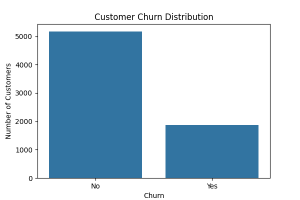
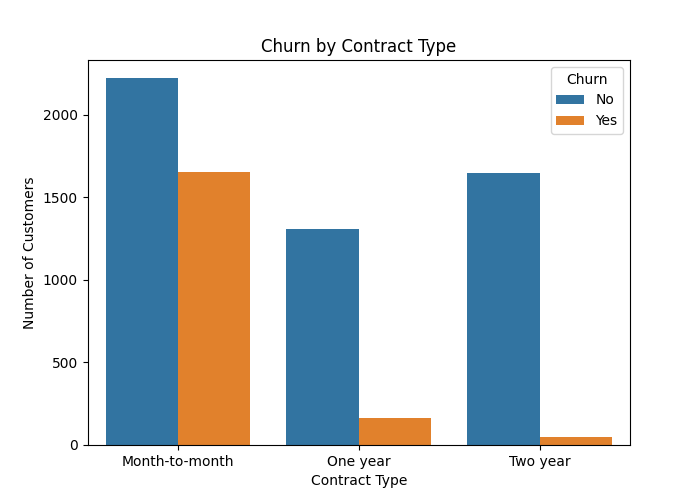
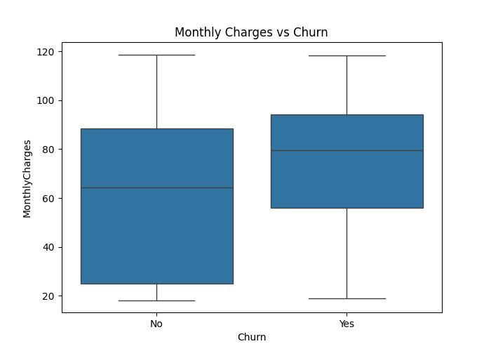
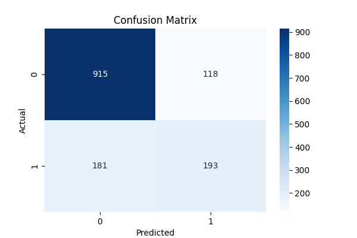

# Customer Churn Prediction

This project predicts customer churn using Machine Learning.  
It analyzes telecom customer data and builds a Logistic Regression model to predict whether a customer will leave the service.

## Technologies Used
- Python
- Pandas
- NumPy
- Scikit-learn
- Matplotlib
- Seaborn

## Project Workflow
1. Data Cleaning
2. Data Preprocessing
3. Machine Learning Model
4. Model Evaluation
5. Data Visualization

## Model
Logistic Regression

## Results
The model predicts whether a telecom customer will churn based on service usage and billing features.

---

## Visualizations

### Churn Distribution

### Churn by Contract Type

### Monthly Charges vs Churn

### Confusion Matrix

---

## Author
Sajith
